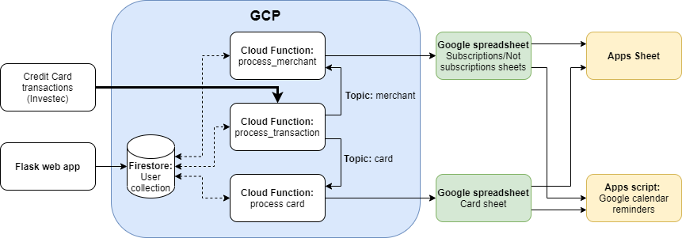

# [Snitch]((https://hackathon-202106.ue.r.appspot.com/)) :speech_balloon:

> "It’s a Remembrall! Gran knows I forget things — this tells you if there’s something you’ve forgotten to do. Look, you hold it tight like this and if it turns red — oh ... you’ve forgotten something ..."
— Neville explaining his Remembrall

Ever wish you had access to [Neville Longbottom's Remembral](https://harrypotter.fandom.com/wiki/Remembrall) when you got a new credit card and had to update all your subscription information on Netflix, Uber, Takealot, etc. Although Snitch is not a magical little ball, it will help you remember when the time comes to update your credit card information.

Snitch works by remembering where you used your credit card, and then deciding if that merchant is a subscription or not. You can tell Snitch when your credit card expires, and Snitch will remind you about all the pesky little updates you need to do before your card has expired. 

 TODO: add demo video

## Getting started
Create a user [here](https://hackathon-202106.ue.r.appspot.com/) and follow the steps to get started using this project. 

# Index
1. [Overview](#overview)
2. [Technical Details](#technical-details) 
    1. [Technology used](#technology-used)
    2. [Design](#design)
3. [Setup your own Snitch](#setup-your-own-snitch)
4. [Future improvements](#future-improvements)

# Overview
The project analyses credit card transactions and creates a list of merchants were the credit card information is potentialy stored, such as online stores or for subscription services. This list can then be used to update the credit card information with various merchants when the credit card expires. The list of merchants can also be used to gain other insights.

The project also sets up automatic notifications linked to your Google Calendar. When the expiry date of a card grows near, you will receive Google Calendar notifications reminding you to update your card info and where to update your card info.

The most important feature of the project: you remain in control of your data. We **do not** store any transaction information. All your transaction is stored in your own personal Google Sheet. If at any time you wish to stop using the service, you can remove the GCP service account frm the sheet and the system will not have access to you information any more.

This allows you to avoid paying penalties for transactions charged to your expired credit cards. You will also avoid late fees by updating your credit card information as soon as you have received your new credit card.

Cancelling a credit card? The list shows you where your soon to be credit card is used, allowing you to cancel these services and subcriptions, or updating the credit card info with a new one.

This project can also potentially save you money. The list can be used to analyse what type of services you pay for regulary, allowing you to decide if you need to cancel any service if necesary. 

# Technical details
## Technology used
The project is built using:
- GCP Cloud Functions, Firestore, Pub/Sub
- Python
- [Apps Script](https://developers.google.com/apps-script)
- [AppSheet](https://www.appsheet.com/)
- Flask

## Design
The application stores user account details in a GCP firestore collection. The Flask web app connects to the collection to create and retrieve user details.

Every time a card transaction is made, the transaction information is sent to the `process_transaction` cloud function. The merchant information and card information is seperated and processed. The merchant information is published to the `merchant` Pub/Sub topic. The card information is published to the `card` Pub/Sub topic.

The `process_merchant` cloud function is triggered by the message published to the `merchant` topic. The cloud function determines if the merchant is in either the **Subscriptions**/**Not subscriptions** sheets or not. If the merchant information is not in either sheet, it is added to the relevant sheet based on the categorisation thereof. If the merchant information is already stored in one of the sheets, the merchant information is updated where necessary.

The `process_card` cloud function is triggered by the message published to the `card` topip. The cloud function determines if the card information is stored in the **Credit card** sheet. If the credit card information is not in the sheet, it is added.

# Setup your own Snitch
Don't want to sign up for one more user account? Would you rather do things the hard way and deploy your own version? No problem. Follow [these steps](docs/SETUP.md#follow-these-steps-to-deploy-your-own-snitch) to set up your own version of the project on Google Cloud.

# Future improvements
There are various ways this project can be improved upon, including:
- Improve the merchant information classification
- Add a **scalable** mobile app
