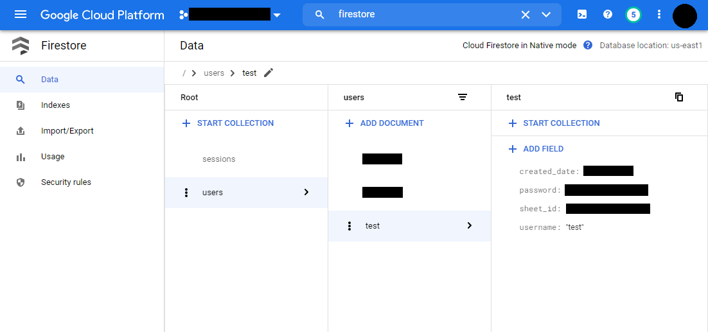

# Follow these steps to deploy your own Snitch
1. [Create a Google Cloud Project](#create-a-google-cloud-project)
2. [Create a Firestore database](#create-a-firestore-database) 
3. [Create Cloud Functions](#create-cloud-functions)
4. [Upload code to Investec Programmable Banking card](#upload-code-to-investec-programmable-banking-card)
5. [Add Apps Scripts to Google spreadsheet](#add-apps-scripts-to-google-spreadsheet)


## Create a Google Cloud Project
Follow  [these steps](https://cloud.google.com/resource-manager/docs/creating-managing-projects#gcloud) to create a GCP project. You need to configure your local terminal to deploy cloud functions in later steps. To do so, you need to set the project-id:
1. Check your project:
  ```
  gcloud config get-value project
  ```
2. Set the project id:
  ```
  gcloud config set project <PROJECT_ID>
  ```

## Create a Firestore database
### Firestore is used to store user info. The user info stored includes:
- user id
- spreadsheet id

### Important considerations
- Choose the database **location** in the same area where the Cloud Functions instances will be created.
- Create the Firestore instance in **native** mode.

### Instructions
- Follow [these instructions](https://cloud.google.com/firestore/docs/quickstart-servers#create_a_in_native_mode_database) to create a Firestore instance in your GCP project.

## Create Cloud Functions
### a. Process transactions
#### What this function does:
This functions processes transaction and user information. 
- Validates provided user data (aka checks if the user is registered)
- Extracts the merchant information
- Determines if the transaction is a subscription or not based on the merchant information
- Sends the processed merchant information to the [process_merchant]() cloud function
- Extracts card information and sends it to the [process_card]() cloud function.

#### Deploy the function using `gcloud` ([Google cloud SDK](https://cloud.google.com/sdk/docs/install))
  ```
  gcloud functions deploy process-transaction --entry-point=process_transaction --runtime=python38 --trigger-http --region=[REGION] --memory=128MB --timeout=60s --env-vars-file .env.yaml
  ```

### b. Process merchants
#### What this function does
This functions processes merchant and user information. 
- Checks if the merchant information provided already exists in the google spreadsheet owned by the user
- Adds the merchant information to the spreadsheet if the merchant does not exists - either in the **Subscriptions** or **Not subscriptions** sheets
- Updates the merchant info, such as the last transaction date, in the spreadsheet
  - If the last transaction was exactly **n** months or **n** years ago, non-subscriptions are changed to subscriptions

#### Deploy the function using `gcloud` 
  ```
  gcloud functions deploy process-merchant --entry-point=process_merchant --runtime=python38 --trigger-topic merchant --region=[REGION] --memory=256MB --timeout=60s --env-vars-file .env.yaml
  ```

### c. Process cards
#### What this function does
This functions processes card and user information. 
- It checks if the card info provided already exists in the spreadsheet owned by the user
- Adds the card info to the spreadsheet if the card does not exists
- Updates the card info in the spreadsheet if the card already exists

#### Deploy the function using `gcloud` 
  ```
  gcloud functions deploy process-card --entry-point=process_card --runtime=python38 --trigger-topic card --region=us-east1 --memory=256MB --timeout=60s --env-vars-file .env.yaml
  ```

### d. Create and format a Google spreadsheet
#### In GCP, create a GCP service account to access the Google sheets:
Create a new service account and create a service account key. The service account key will be downloaded to a .json file. Create a new secret in the secrets manager calles `SHEETS`. Add the service account key file to the `SHEETS` secret.


#### In Google Spreadsheets:
Create a blank spreadsheet and copy the spreadsheet ID from the spreadsheet url.
```
https://docs.google.com/spreadsheets/d/[SPREADSHEET_ID]/edit#gid=0
```
Add the service account to the spreadsheet with editor writes.

#### In GCP Firestore:
Add a dummy user to the **user** collection in Firestore.

Make sure the document id matches the username field. 
Add the spreadsheet ID to the `sheet_id` field in the user document.

#### In GCP Cloud Functions:
Run the `format sheet` cloud function to initialise your spreadsheet.


## Upload code to Investec Programmable Banking card

The same code is used for all your cards. 

### Environmental variables
To set up the environment variables on the Investec Programmable Card, the transaction API URL and an user ID is required.

To get the transaction API URL, navigate to the trigger page of the **process-transaction** cloud function. 


Add the transaction API URL and the user ID to the environment variables code below. Add the code to your to the env.json file on your Investec Programmable Card. Note, you can still use your own environmental variables as well.
```
{
    "your_variable": "another variable you might have",
    "transactionApi": "TRANSACTION API LINK",
    "user_id": "USER IDENTIFIER"
}
```
### Code
Add the following code to your to the main.js file. Note, you can still use your own code as well. By default this code only executes on simulation. You can remove that limitation if you want to process production data.
```
{
    async function pushTransaction(transaction) {
        try {
            const response = await fetch(process.env.transactionApi, {
                method: 'POST',
                headers: {  'Content-Type': 'application/json'},
                body: JSON.stringify({
                    "transaction": transaction,
                    "user_id": process.env.user_id
                })
            });
            responseLog = {
                status: response.status,
                statusText: response.statusText,
                serverMessage: (await response.text())
            }
            console.log(JSON.stringify(responseLog))
        }
        catch (e) {
            console.log(e)
        }
    };
    
    // This function runs during the card transaction authorization flow.
    // It has a limited execution time, so keep any code short-running.
    const beforeTransaction = async (authorization) => {
        return true;
    };
    
    // This function runs after a transaction.
    const afterTransaction = async (transaction) => {
        if (transaction.reference === 'simulation') {
            // this is a simulated transaction
            await pushTransaction(transaction)
        }
        else {
            // this is a production transaction
        }
    };
}
```


## Add Apps Scripts to Google spreadsheet

With Apps Script you can configure reminders to notify you which subscriptions should be renewed when a credit card expires.

### Create a new script
From your Google Sheet, go to `Tools -> Script editor`. This will open a new tab with Apps Script. You can rename the script if you wish.

### Copy code to Apps Script
Copy the code below the the Apps Script editor and click on the `save` icon.


Code to copy:
 ```
 // get spreadsheet
    var spreadsheet = SpreadsheetApp.getActiveSpreadsheet();
    function doGet(e){
      remindMeAboutSubscriptions();
      return HtmlService.createHtmlOutput('').setSandboxMode(HtmlService.SandboxMode.IFRAME);
    }
    function remindMeAboutSubscriptions() {
      // get card info
      var expiringCards = getCardsByExpiry(spreadsheet,30,1);
      // get subscriptions
      var subscriptionReminders = getSubscriptionsByExpiringCard(spreadsheet,expiringCards);
      // notify user
      //sendReminderEmail(subscriptionReminders);
      createCalendarReminder(subscriptionReminders);
    }
    function getCardsByExpiry(spreadsheet,Reminder1_DaysToExpiry) {
      //get credit cards sheet
      var sheet = spreadsheet.getSheetByName('Credit cards');
      //get values
      var data = sheet.getDataRange().getValues();
      var cards = {};
      for (var i = 1; i < data.length; i++) {
        if(data[i][3]!=""){
          continue
        }
        var expiryDate = new Date(data[i][2]);
        var dateNow = new Date();
        var difference= Math.abs(expiryDate-dateNow);
        var daysToExpiry = difference/(1000 * 3600 * 24)
        if(daysToExpiry<=Reminder1_DaysToExpiry)
        {
          cards[i-1] = {"id":data[i][0],"cardnumber":data[i][1], "expity":data[i][2],"reminderdate":data[i][3]}
        }
        //Logger.log('Card id: ' + data[i][0]);
        //Logger.log('Card number: ' + data[i][1]);
        //ogger.log('Expiry: ' + data[i][2]);
      }
      return cards
    }
    function getSubscriptionsByExpiringCard(spreadsheet,expiringCards) {
      var subscriptions = {};
      var cardCount = Object.keys(expiringCards).length;
      if(cardCount<1)
      {
        return subscriptions;
      }
      //get Merchants sheet
      var sheet = spreadsheet.getSheetByName('Subscriptions');
      //get values
      var data = sheet.getDataRange().getValues();
      var subscriptionCount = 0;
      for (var i = 0; i < cardCount; i++) {
          cardId = expiringCards[i]["id"]
          cardNumber = expiringCards[i]["cardnumber"]
          subscriptions[i] = {}
          subscriptions[i]["id"] = expiringCards[i]["id"]
          subscriptions[i]["cardnumber"] = cardNumber
          subscriptions[i]["expiry"] = expiringCards[i]["expity"]
          var filteredData = data.filter(function(item){
              return (item[1] == cardId)&&(item[2] == true);         
          });
          subscriptions[i]["subscriptions"] = filteredData
          subscriptionCount+=1;
      }
      return subscriptions
    }
    function sendReminderEmail(subscriptionReminders){
      Object.keys(subscriptionReminders).forEach(function(key){
        var cardId = subscriptionReminders[key]["id"];
        var cardNumber = subscriptionReminders[key]["cardnumber"];
        var cardExpiryDate = subscriptionReminders[key]["expiry"];
        var subscriptions = subscriptionReminders[key]["subscriptions"];
        var subscriptionList = ""
        for (var i = 0; i < subscriptions.length; i++) {
          subscriptionList+=`<li>${subscriptions[i][3]} (${subscriptions[i][9]})</li>`;
        }
        //https://www.tutorialspoint.com/online_html_editor.php
        var htmlEmailBody = 
          `<!DOCTYPE html>
          <html>
            <head>
                <title>reminder</title>
            </head>
            <body>
                <h2>${cardNumber} - Expiring ${cardExpiryDate}</h2>
                <h3>Subscriptions linked to this card:</h3>
                ${subscriptionList}
            </body>
          </html>`;
        GmailApp.sendEmail(Session.getActiveUser().getEmail(),"Reminder: Update credit card subscriptions",'HTML body here',{htmlBody: htmlEmailBody}) 
        recordReminderInformation(cardId,new Date())
      });
    }
    function createCalendarReminder(subscriptionReminders){
      Object.keys(subscriptionReminders).forEach(function(key){
        var cardId = subscriptionReminders[key]["id"];
        var cardNumber = subscriptionReminders[key]["cardnumber"];
        var cardExpiryDate = subscriptionReminders[key]["expiry"];
        var subscriptions = subscriptionReminders[key]["subscriptions"];
        var subscriptionList = ""
        for (var i = 0; i < subscriptions.length; i++) {
          subscriptionList+=`<li>${subscriptions[i][3]} (${subscriptions[i][9]})</li>`;
        }
        //https://www.tutorialspoint.com/online_html_editor.php
        var htmlEmailBody = `<html><h2>${cardNumber} - Expiring ${cardExpiryDate}</h2><h3>Subscriptions linked to this card:</h3>${subscriptionList}</html>`;
        var event = {
          location: 'Online',
          description: htmlEmailBody,
          //attendees: [
            //{email: 'alice@example.com'},
            //{email: 'bob@example.com'}
          //],
          // Red background. Use Calendar.Colors.get() for the full list.
          colorId: 11
        };
        eventReminder = CalendarApp.createAllDayEvent("Renew credit card subscriptions",new Date(cardExpiryDate),event)
        eventReminder.addEmailReminder(1*60*12*30)
        recordReminderInformation(cardId,new Date())
      });
    }
    function recordReminderInformation(cardId,timestamp) {
      //get credit cards sheet
      var sheet = spreadsheet.getSheetByName('Credit cards');
      //get values
      var data = sheet.getDataRange().getValues();
      for (var i = 1; i < data.length; i++) {
        if(data[i][0]==cardId)
        {
          sheet.getRange(i+1, 4).setValue(timestamp);
        }
      }
      // Make sure the cell is updated right away in case the script is interrupted
      SpreadsheetApp.flush();
    }
 ```

### Create a trigger
Set up a trigger that will execute the code above on a schedule. 


Note: When you Save the trigger, it will make a pop-up that asks you to Sign In with your Google account. After you Sign In you will get the warning that "Google hasn’t verified this app". If you trust the app, click on Advanced and then Go to <your_app> (unsafe) and Allow the app.


[:arrow_left: Go back to Setup list](../README.md#setup)